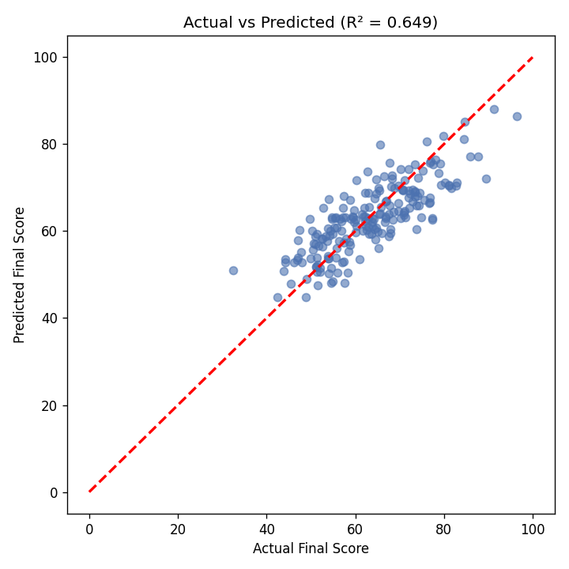
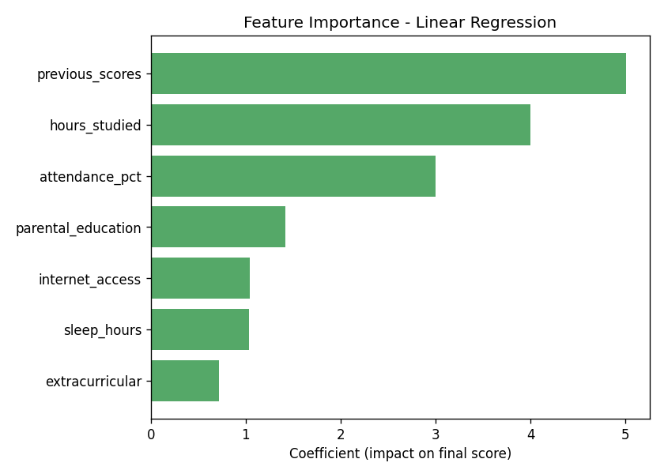

# 🎓 Student Performance Prediction

A beginner-friendly, end-to-end **Machine Learning** project that predicts a student's final exam score based on study habits, attendance, sleep, and background factors — using **Linear Regression**.

🔗 **Live Demo**: _add your Streamlit Cloud link here after deploying (see below)_



---

## 📌 Overview

This project demonstrates a complete, real-world ML workflow:

1. **Data Generation** — a realistic synthetic dataset (with missing values, duplicates, and outliers, just like real data)
2. **Data Cleaning** — handling missing values, removing duplicates, fixing outliers, encoding categories
3. **Exploratory Data Analysis (EDA)** — distributions, correlations, visual insights
4. **Model Training** — Linear Regression with Scikit-Learn
5. **Evaluation** — MAE, RMSE, R² score + visualizations
6. **Deployment** — an interactive Streamlit web app for live predictions

## 🛠️ Tech Stack

| Tool | Purpose |
|---|---|
| Pandas | Data manipulation & cleaning |
| NumPy | Numerical operations |
| Scikit-Learn | Linear Regression model, train/test split, scaling, metrics |
| Matplotlib / Seaborn | Visualization |
| Streamlit | Interactive live web app |
| Joblib | Model persistence |

## 📂 Project Structure

```
student-performance-prediction/
├── data/
│   ├── student_raw.csv          # raw (messy) generated dataset
│   └── student_clean.csv        # cleaned dataset
├── src/
│   ├── generate_dataset.py      # creates the synthetic dataset
│   ├── data_cleaning.py         # cleaning pipeline
│   └── train_model.py           # trains & evaluates the model
├── notebooks/
│   └── student_performance_EDA.ipynb   # full EDA + walkthrough notebook
├── models/
│   ├── linear_regression_model.pkl
│   ├── scaler.pkl
│   └── metrics.txt
├── plots/
│   ├── actual_vs_predicted.png
│   └── feature_importance.png
├── app.py                       # Streamlit live demo app
├── requirements.txt
└── README.md
```

## 📊 Dataset Features

| Feature | Description |
|---|---|
| `hours_studied` | Average hours studied per day |
| `attendance_pct` | Class attendance percentage |
| `previous_scores` | Previous exam score (0-100) |
| `sleep_hours` | Average sleep hours per night |
| `extracurricular` | Participates in extracurricular activities (Yes/No) |
| `parental_education` | Highest parental education level |
| `internet_access` | Has internet access at home (Yes/No) |
| `final_score` | **Target** — final exam score (0-100) |

> Dataset is synthetically generated for learning purposes, with realistic relationships and intentional messiness (missing values, duplicates, outliers) so the cleaning step has real work to do.

## 📈 Model Results

| Metric | Score |
|---|---|
| MAE | ~5.2 |
| RMSE | ~6.4 |
| R² | ~0.65 |

**Top predictive features:** `previous_scores`, `hours_studied`, `attendance_pct`



## 🚀 How to Run Locally

```bash
# 1. Clone the repo
git clone https://github.com/<your-username>/student-performance-prediction.git
cd student-performance-prediction

# 2. Install dependencies
pip install -r requirements.txt

# 3. Run the pipeline (generates data, cleans it, trains the model)
python src/generate_dataset.py
python src/data_cleaning.py
python src/train_model.py

# 4. Launch the live demo app
streamlit run app.py
```

The app will open at `http://localhost:8501`.

## 🌐 Deploy It Live (Free, 5 minutes)

1. Push this project to a **public GitHub repo**
2. Go to **[share.streamlit.io](https://share.streamlit.io)** and sign in with GitHub
3. Click **"New app"** → select your repo → set main file to `app.py` → click **Deploy**
4. Copy the live URL and add it to this README and your resume! 🎉

## 📝 What I Learned

- Building a clean, reproducible ML pipeline from raw data to deployment
- Practical data cleaning techniques (imputation, outlier handling, encoding)
- Training and evaluating a regression model with Scikit-Learn
- Deploying an interactive ML app for non-technical users with Streamlit

## 📄 License

This project is open-source and free to use for learning purposes.

---

### ⭐ If you found this helpful, consider giving it a star on GitHub!
